<!-- Profile README for @WikipediaBrown.
     `WikipediaBrown/WikipediaBrown` is a same-name-as-username repo, so
     GitHub renders this README at the top of the profile page. Same repo
     also hosts wikipediabrown.dev from /docs. -->

 

---

I design and build [CI/CD](https://fastlane.tools/), [MDM](https://support.apple.com/guide/deployment/intro-to-mdm-profiles-depc0aadd3fe/web), [AI/ML](https://developer.apple.com/machine-learning/), [VDI](https://developer.apple.com/documentation/virtualization), and [CUA](https://openai.com/index/computer-using-agent/) systems customers use to run fleets of Macs on Apple Silicon. After hours: iOS apps, macOS tools, and open-source Swift.

Shipped at **Capital One** · **Uber** · **Robinhood** · **Apple** · **Amazon Web Services**.

### Currently shipping

<table>
<tr>
<td width="33%" valign="top">

#### [Spooktacular](https://spooktacular.app/)

Open-source macOS VM manager for Apple Silicon. Ephemeral runner pools, warm-pool scrub validation, Kubernetes orchestration. **424 tests, MIT-licensed.**

</td>
<td width="33%" valign="top">

#### [napkin](https://getnapkin.to)

A Swift 6.2 framework for building apps as a tree of isolated, composable units. Uber's RIBs pattern, rebuilt for Swift Concurrency.

</td>
<td width="33%" valign="top">

#### [SFSymbolsKit](https://sfsymbolskit.com)

A small Swift package for working with SF Symbols. Extensions on `String`, `UIImage`, and `NSImage`; the full symbol catalog is generated by a Python script.

</td>
</tr>
</table>

### The stats

Refreshed daily by GitHub Actions — generated and committed to this repo, so it always loads.

### Certifications

| | Credential | Verify |
|---|---|---|
|  | **AWS Certified AI Practitioner** | [Credly ↗](https://www.credly.com/badges/3ca88eef-4a27-4623-af70-ab9df1c46f34) |
|  | **AWS Certified Cloud Practitioner** | [Credly ↗](https://www.credly.com/badges/dffecc92-f656-4742-af20-add54d9c3634) |
